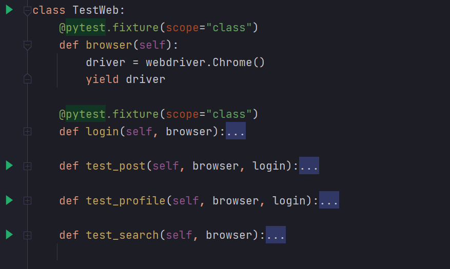
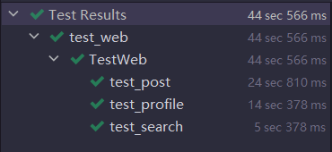

# pyDemo


自动化测试中关于关键字驱动、封装操作、单元测试 pytest、yaml 数据驱动的小demo。


# 目录


- 关键字驱动
- 封装操作
- 单元测试 pytest
- yaml 数据驱动


## 01 关键字驱动


在自动化测试中，什么是关键字驱动?


关键字驱动是一种测试方法，它**将测试步骤和测试数据分离**开来，**测试步骤由关键字表示**。关键字是一些代表某个特定操作的单词或短语，比如“点击”、“输入”、“验证”等。测试数据则是用于输入到被测试应用程序中的数据，比如用户名、密码等。关键字驱动测试框架允许测试人员使用这些关键字来构建测试脚本，而不必编写任何代码。

在关键字驱动测试中，测试用例由一组关键字和测试数据组成。测试人员只**需要编写一次测试步骤，并根据需要编写多组测试数据来测试不同的情况**。测试执行过程中，测试框架会读取测试数据并执行相应的关键字，从而完成测试。这种方法可以有效地提高测试的重复性和可维护性。同时，由于测试步骤和测试数据的分离，测试人员也可以更加专注于测试用例本身，而不必担心代码实现的细节。


在 `test_web.py` 中的测试类中，login 是测试 A 网站的登录操作，test_post 是测试 A 网站的发布文章，test_profile 是测试 A 网站的修改个人主页信息，test_search 是 B 网站的搜索功能。测试步骤由这几个关键字表示。

```python
class TestWeb:
    @pytest.fixture(scope="class")
    def browser(self):
        driver = webdriver.Chrome()
        yield driver

    @pytest.fixture(scope="class")
    def login(self, browser): ...

    def test_post(self, browser, login): ...

    def test_profile(self, browser, login): ...

    def test_search(self, browser): ...


```


## 02 二次封装


如何进行封装操作？


在自动化测试中，封装操作指的是将某个操作或一组操作封装在一个函数或一个类中，以便于复用和维护。通过封装，可以将测试用例中的重复操作抽象成一个单一的可重复使用的函数或类，从而提高测试代码的可读性、可维护性和可扩展性。

例如，在一个电商网站中，对于登录操作，可以将输入用户名和密码、点击登录按钮等步骤封装在一个名为 login 的函数中。这样，在测试用例中，只需要调用 login 函数即可完成登录操作，而不需要在每个测试用例中都写一遍相同的登录代码，从而提高了测试代码的可重用性和可维护性。


在 `test_web.py `中，有登录、发布文章、修改个人主页等操作需要测试。应该如此书写：





这样的好处就在于：当你只想要测试 test_post 时，直接点击左边的小三角即可，由于参数中带有 login ，会自动先运行 login 进行登录操作。这里的 login 是带有 `@pytest.fixture(scope="class")` 的，这将在 pytest 中介绍到。


### 写一个基类


将一些共性的操作或属性封装到一个基类中，然后其他类可以继承这个基类，从而避免重复编写相同的代码。这样做可以提高代码的复用性，减少代码的冗余，并且方便后期的维护和修改。基类中通常包含了一些常用的方法和属性，比如页面的打开、元素的查找、元素的操作等等，这些都是其他类所共用的基本操作。

当然，这只是一个例子，当需要什么操作时，同时发现又是公用的方法，就可以持续再添加。


```python
from selenium.webdriver import ActionChains
from selenium.webdriver.common.by import By
# expected_conditions 是 WebDriverWait 类中的一个子模块，它包含了许多用于等待页面元素出现或某些条件成立的方法。
from selenium.webdriver.support import expected_conditions as EC
from selenium.webdriver.support.ui import WebDriverWait


class BasePage:
    def __init__(self, driver):
        self.driver = driver
        self.wait = WebDriverWait(driver, 10)

    def open(self, url):
        self.driver.get(url)

    def wait_for_element(self, locator, timeout=10):
        # presence_of_element_located: 表示等待页面元素出现在DOM中，但不一定可见，直到找到该元素或等待超时。
        # visibility_of_element_located: 表示等待指定的元素在页面中可见。
        return WebDriverWait(self.driver, timeout).until(EC.presence_of_element_located(locator))

    def click(self, locator):
        # 显性等待: 等待元素显示再执行 click()
        self.wait_for_element(locator).click()

    def send_keys(self, locator, text):
        element = self.wait_for_element(locator)
        element.clear()
        element.send_keys(text.strip())

    def hover(self, locator):
        element = self.wait_for_element(locator)
        ActionChains(self.driver).move_to_element(element).perform()

    def switch_to_new_window(self, page=1):
        current_handle = self.driver.current_window_handle
        handles = self.driver.window_handles
        if len(handles) < page:
            raise ValueError("Invalid page number")
        new_handle = handles[page - 1]
        if new_handle == current_handle:
            raise ValueError("New window is the same as current window")
        self.driver.switch_to.window(new_handle)

    def refresh(self, timeout=10):
        self.driver.refresh()
        # 这里指定了<body>标签，因为这是页面中最后加载的元素之一。
        WebDriverWait(self.driver, timeout).until(EC.presence_of_element_located((By.TAG_NAME, 'body')))

    def get_input_value(self, locator):
        element = self.wait_for_element(locator)
        # return element.get_attribute("value")
        return element.get_property("value")

    def scroll_to_element(self, locator):
        element = self.wait_for_element(locator)
        # arguments[0]: 引用 element 参数
        self.driver.execute_script("arguments[0].scrollIntoView();", element)

```


## 03 单元测试 pytest


有必要使用单元测试pytest吗？它有什么优点？


在自动化测试中使用单元测试框架pytest是一种很好的选择，它可以帮助开发者更加高效地编写测试用例，并且提供了丰富的功能和测试报告，可以帮助开发者更加直观地了解测试的结果。

1. 方便运行和管理测试用例。pytest可以自动收集和运行测试用例，并且支持多种运行方式，例如运行所有测试用例、运行某个目录下的测试用例等。同时，pytest支持灵活的命令行选项，可以根据需要配置测试用例运行的方式。
2. 易于编写和组织测试用例。pytest提供了丰富的fixture机制，可以在测试用例执行前后进行一些准备和清理工作，并支持多种fixture的组合和参数化方式，可以帮助编写出更加灵活和可复用的测试用例。
3. 提供丰富的断言和报告机制。pytest支持多种断言方式，并且可以生成详细的测试报告，包括测试用例的执行情况、错误信息、测试覆盖率等。
4. 支持插件扩展。pytest提供了大量的插件，可以方便地扩展其功能，例如支持测试数据的参数化、支持分布式执行测试用例等。


### 3.1 fixture 的装饰器


回到前面提到的 @pytest.fixture(scope="class") 是什么？


`@pytest.fixture(scope="class")` 是 Pytest 测试框架中用来定义测试 fixture 的装饰器，它通常被用于为测试类提供一些初始化操作，例如打开浏览器、登录、连接数据库等。

其中，`scope` 参数表示 fixture 的作用域，可以是 `"function"`（默认）、`"class"`、`"module"` 或 `"session"`，分别表示在每个测试函数、测试类、测试模块或整个测试 session 执行前只执行一次。

在上面的代码中，`@pytest.fixture(scope="class")` 被用来定义两个 fixture，即 `browser` 和 `login`，它们的作用域都是测试类。也就是说，每个测试类在执行前都会调用 `browser` 和 `login` fixture 进行初始化操作。同时，由于 `browser` fixture 是在 `login` fixture 之前被调用的，所以可以在 `login` fixture 中使用已经初始化好的 `browser` 对象来进行登录操作。


```python
class TestWeb:
    @pytest.fixture(scope="class")
    def browser(self):
        driver = webdriver.Chrome()
        yield driver

    @pytest.fixture(scope="class")
    def login(self, browser): ...

    def test_post(self, browser, login): ...

    def test_profile(self, browser, login): ...

    # 这是测试 B 的搜索，不需要 login ，所以不携带该参数
    def test_search(self, browser): ...

```


### 3.2 断言


断言是编程中的一种常用技术，用于**检测程序的运行结果是否符合预期**。在测试中，断言通常用于检查代码的行为是否符合预期，即在测试代码中使用一些语句来判断测试是否通过或失败。**如果断言条件为 True，测试继续执行；否则，测试将被标记为失败。**断言可以帮助开发者快速定位问题，以便在代码的早期阶段发现和修复错误，提高代码的质量和可维护性。


Pytest 的断言模块 `assert` 提供了多种断言方式，可以对不同类型的数据进行比较和判断。

一些常见的断言方法包括：

- `assert`：判断表达式为真，否则抛出异常。
- `assertEqual(a, b)`：判断 a 和 b 是否相等。
- `assertNotEqual(a, b)`：判断 a 和 b 是否不相等。
- `assertTrue(x)`：判断 x 是否为真。
- `assertFalse(x)`：判断 x 是否为假。
- `assertIn(a, b)`：判断 a 是否在 b 中。
- `assertNotIn(a, b)`：判断 a 是否不在 b 中。
- `assertIs(a, b)`：判断 a 是否是 b 对象。
- `assertIsNot(a, b)`：判断 a 是否不是 b 对象。
- `assertIsNone(x)`：判断 x 是否为 None。
- `assertIsNotNone(x)`：判断 x 是否不为 None。
- `assertRaises(exception, callable)`：判断 callable 是否会抛出 exception 异常。
- `assertWarns(warning, callable)`：判断 callable 是否会抛出 warning 警告。

通过使用这些断言方法，可以对测试结果进行判断和验证，确保测试用例的正确性。如果某个断言失败，就会抛出异常，标记该用例为失败。


比如这里的 test_profile ，测试是否修改成功。需要先找到想设置的值，从 yaml 导出，然后点击确认修改。直接从元素获取修改后的值，看看是否一致，如果一致代表修改成功。

使用 `assert info == params` 来判断是否修改成功。

```python
    def test_profile(self, browser, login):
        profile_page = ProfilePage(browser)
        profile_page.open("http://www.hmzilvok.ltd/")
        with open('test_data.yaml', encoding='utf-8') as f:
            profile_data = yaml.safe_load(f)['profile']

        params = [profile_data["username"], profile_data["position"], profile_data["company"],
                  profile_data["personal_profile"], profile_data["introduction"]]

        profile_page.edit_profile(params)

        info = profile_page.get_profile_info()
        assert info == params
        sleep(3)
```


## 04 数据驱动


什么是yaml数据驱动？还有其他格式的数据驱动吗？


YAML数据驱动是一种基于YAML格式的数据驱动方法，可以将测试数据和测试步骤分离，从而更加灵活地执行测试。使用YAML数据驱动的测试用例通常包含两部分：测试数据和测试步骤。测试数据部分是一个字典或列表，包含了测试数据的各种情况，而测试步骤则是一个列表，包含了每个测试步骤的详细信息，包括操作、参数等。通过将测试数据和测试步骤分离，可以方便地修改测试数据，而不需要改变测试步骤，从而提高了测试的可维护性和可扩展性。

除了YAML数据驱动之外，还有其他格式的数据驱动，如CSV、Excel、JSON等。CSV数据驱动使用逗号分隔的值作为测试数据，Excel数据驱动使用Excel文件中的表格作为测试数据，JSON数据驱动使用JSON格式的文件作为测试数据。每种数据驱动方法都有其优点和适用场景，具体应该根据实际情况选择。

INI 格式也可以用于数据驱动测试。INI 格式通常用于配置文件，它以 section 和 key-value pairs 的形式组织数据，比如：

```
[section1]
username = testuser1
password = password1

[section2]
username = testuser2
password = password2
```

你可以使用 Python 的 configparser 库来读取和解析这个文件，然后在测试代码中使用读取到的数据进行测试。但相对于 YAML 或 JSON 格式，INI 格式的可读性和灵活性稍差，不太适合于复杂的数据结构。


### 4.1 YAML


YAML（全称：YAML Ain't Markup Language）是一种轻量级的数据序列化格式，通常用于配置文件、数据传输协议等场景。它的设计目标是易于人类阅读和编写，同时也适合机器解析和生成。YAML采用缩进来表示层次结构，支持列表、字典等常见数据类型。YAML文件的扩展名通常为.yml或.yaml。以下是一个简单的YAML示例：

```yaml
# 定义一个名为 person 的字典
person:
  name: John
  age: 30
  city: New York

# 定义一个名为 fruits 的列表
fruitsList:
  - Apple
  - Orange
  - Banana

# 混合
fruits:
  - name: apple
    color: red
  - name: banana
    color: yellow
```

如何读取？

```python
import yaml

# 读取 yaml 文件
with open('fruits.yaml', 'r', encoding='utf-8') as f:
    data = yaml.safe_load(f)

# 获取 name 和 apple 的值
name = data['fruits'][0]['name']
apple = data['fruits'][0]['color']

print(name)  # 输出：apple
print(apple)  # 输出：red

```


## 05 运行


### 5.1 代码


在 GitHub 上，可自行点击查看：[https://github.com/Bin-lin-rgb/pyDemo]

视频：[https://ksr7oe3m3x.feishu.cn/file/boxcnirca8ktLKllAdjhodODRUP]


### 5.2 运行结果




## 06 一些问题


### 6.1 send_keys 的 clear() 失效了？


一开始我以为是 get_property 获取到重复的两次 value，

为什么有时会获取到重复的两次value？比如 value=‘123’，获取的却是 value=‘‘123123’

```python
    def get_input_value(self, locator):
        element = self.driver.find_element(*locator)
        # return element.get_property("value")
        return element.get_attribute("value")
```


```ini
>       assert info == params
E       AssertionError: assert ['1234', '软件工程师软件工程师', '广州大学广州大学', '获得某某奖', '开朗活泼'] == ['1234', '软件工程师', '广州大学', '获得某某奖', '开朗活泼']
E         At index 1 diff: '软件工程师软件工程师' != '软件工程师'
E         Full diff:
E         - ['1234', '软件工程师', '广州大学', '获得某某奖', '开朗活泼']
E         + ['1234', '软件工程师软件工程师', '广州大学广州大学', '获得某某奖', '开朗活泼']
```


后来我看了数据库，发现存进去的就是 `'软件工程师软件工程师'`，所以是 send_keys 的 clear() 出了问题，太快了导致失效，重新又写了一遍`'软件工程师'`所致。然后 debug 一下，发现又没有问题了。

目前解决方法就是 sleep 一点时间，硬性等待一下，不知还有其他办法没有。


```python
def wait_for_element(self, locator, timeout=10):
    return WebDriverWait(self.driver, timeout).until(EC.presence_of_element_located(locator))

def send_keys(self, locator, text):
    element = self.wait_for_element(locator)
    element.clear()
    element.send_keys(text.strip())

```


